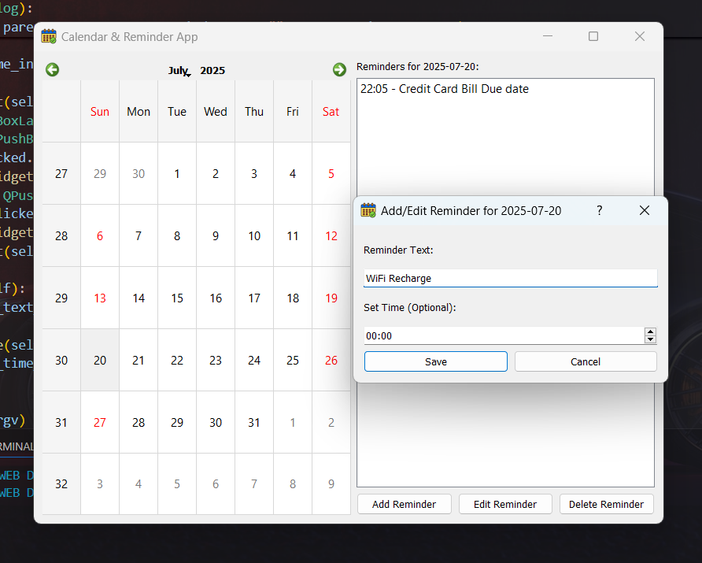

# 🗓️ Calendar & Reminder App

🎉 **Internship Task Completed for Pinnacle Labs Pvt. Ltd.**

This project is part of my Python Development Internship at **Pinnacle Labs Pvt. Ltd.** I was tasked with creating a desktop application that displays a **monthly calendar** and allows users to **set, manage, and delete reminders** with ease.

---

## 📌 Project Overview

This Python application features:
- A functional **calendar view**
- Interactive **reminder management**
- A clean **desktop GUI** built using **PyQt5**

---

## ✨ Features

- 📅 **Monthly Calendar Display**  
  Navigate and select dates using an intuitive calendar view.

- ⏰ **Add, Edit, Delete Reminders**  
  Assign custom text and optional time to any date.

- 🧠 **Reminder Preview**  
  View all reminders for a selected day at a glance.

- 💻 **Simple Yet Efficient UI**  
  Designed with PyQt5 for a modern and user-friendly experience.

---

## 💻 Technologies Used

- `Python`
- `PyQt5` – for the graphical user interface (GUI)

---

## ❓ Why PyQt5 Instead of Tkinter?

While Tkinter is a classic GUI toolkit, I chose **PyQt5** because:

- It offers **modern widgets** and professional aesthetics.
- Provides **flexible layouts** and scalable components.
- Ideal for building feature-rich desktop applications.

This was also my **first experience** with PyQt5, and it proved to be a great learning opportunity.

---

## 🧠 What I Learned

Working on this task helped me:

- Understand **event-driven programming**
- Gain **hands-on experience with PyQt5**
- Learn better ways to **structure GUI applications** in Python
- Improve my ability to **debug and test** GUI elements

---

🖼️ Screenshot

  
<sub>📸 Screenshot of the Calendar & Reminder App UI</sub>

---

## 📂 Repository Contents

- `main.py`: The complete Python source code for the app
- `calendar.png`: Application icon used in the GUI
- `README.md`: You're reading it!

> ✅ Feel free to fork the repo, raise issues, or submit improvements via pull requests.

---

## 🧪 Getting Started

To run the application locally:

```bash
git clone https://github.com/yourusername/calendar-reminder-app.git
cd calendar-reminder-app
pip install PyQt5
python main.py
